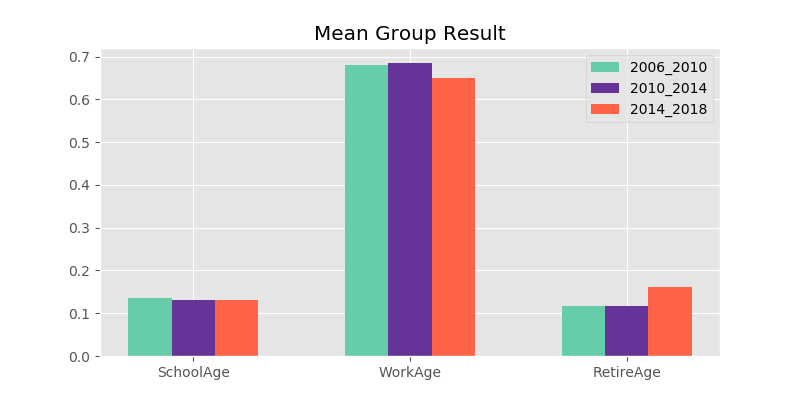

# Denver Demographic Study

## Introduction 

I am a newcomer to Denver, moved here from California at the beginning of 2019.  We are drawn to Colorado by its natural beauty, the diverse culture presence, abundant art and music scenes, and fast growing high-tech industry. 

I have read that City of Denver has changed significantly in the past 10-15 years.  There are many angles to view these changes.  In this study, I would like to focus on changes in the demographic compositions, specifically:

* According to [Wikipedia](https://en.wikipedia.org/wiki/Denver#Demographics), City and County of Denver observed a net growth of 172,575 in population between year 2000 and 2019.  That is an average annual growth rate of 1.43%.   As the city's number of residents grows, has the median age of the city changed in a significant way?  If most of the population growth are caused by peopole immigrating to Denver in seek of job opportunities, does it mean that the city is growing younger over time? 
* House ownership. Denver has observed one of the fastest growing housing markets in recent years.  Has home ownership decreased over time as the local real estate market gets "hotter" and gradually "out-of-reach"?
* With the "me-too" movements, there has been more awareness and demand for gender equality in recent years.  How is Denver doing in this regard?  Is the pay gap between male and female getting smaller over time? 
* As the city re-invents various neighborhoods, how has the neighborhoods popularity change for different age groups?  
* As the city grows and industries expand, how has the income levels of different neighborhoods change?   


## Raw Data

I found the American Community Survey (ACS) data at the block group level on the [Denver Open Data Catalog.](https://www.denvergov.org/opendata)  The United States Census Bureau generates the ACS data.  

Census blocks are introduced in 1990, and they are the smallest statistical units for which surveys are conducted.  Census blocks are by design small in area and typically bounded by streets in the city and natural landmarks in the suburbs and rural areas.  In more remote areas, census blocks may encompass hundreds of square miles.  In total, there are approximately 8,200,000 blocks in the U.S. and Puerto Rico. The census block group is one tier above the census block.  There are roughly 39 blocks per each census group, with each block group generally containing between 600 to 3,000 people.   There are 211,267 block groups in the U.S. and Puerto Rico. In the 2000 census, Census tracts are introduced as the tier above block group.  Census tracts are designed to be homogeneous with respect to population compsitions, social and economic conditions, and living status.  Census tracts generally have between 1,500 and 8,000 people.  In this study, we rely on data at the census block group level.  It is the smallest geographical unit for which the Bureau publishes sample data.  For the City and County of Denver, there are 481 block groups.       

U.S. Census Bureau conducts comprehensive household surveys every 10 years.  This year (2020) is a census year.  During each 10-year interval, the Bureau contacts 3.5 million households across the country to participate in the annual ACS survey.  The data is then compiled and published as 5-year averages.  The most recent ACS data for the City and County of Denver that I was able to locate is the 2014-2018 average, published on Feb 6, 2020.  I was also able to locate the same ACS survey data for earlier periods 2006-2010 and 2010-2014.  Together these three data sets represents approximately three time periods: before or early stage of the 2008 Financial Crisis (2006-2010), the immediate aftermath and initial recovery stage from the crisis (2010-2014), the more robust recovery and growth stage post the crisis.     

## Calculated Data and The Approach

To answer the questions raised in the "Introduction" section, I studied the data sets and decided to use the following data series: 

* For Age Study, the raw data has median age by overall population, male and female, and various age buckets breakdowns.  I aggregated the age buckets to three: a) less than 18, b) between 18 and 65, and c) above 65, representing school children, adults and retired people.  In the adults category, I also maintained the age group "20_to_29" in hope to represent the grown-up yet no children category. 
* For the Housing Affordability Study, the raw data has the median home value, total housing units and the breakdown by owner versus renter occupied.  I chose to divide the median home value by the median household income as an approximation for housing affordability.  For owner occupancy rate, I divided the number of owner-occupied units by total housing units. 
* For the Gender Pay Equality Study, the raw data has the median earnings by male versus female. 

## Exploratory Data Aanlysis

###  **Age Profile Over Time**

There are 481 census block groups represented in the data sets.  The bar chart below shows the average of the median age per each group across the three time horizons.   


To help reading the data better, the same information is represented the below table. 

| Median Age | All   | Male  | Female |
|------------|------:|------:|-------:|
| 2006-2010  | 36.17 | 35.62 | 36.75  |
| 2010-2014  | 36.15 | 35.65 | 36.99  |
| 2014-2018  | 36.67 | 36.31 | 37.37  |

It seems that over the three time horizons, the median age has gone up for the overall population as well as each gender group, even though marginally so.  

Since the mean doesn't quite capture the overall distribution, let's look at the age profile from a different angle - the percentage of population in each bucket.  Below is the side-by-side bar chart. 



As expected, the adult age bucket takes the chunk of the population.  It is more obvious now that the percentage of retired people has gone up over time, taking about 16% of the overall population for the 2014_2018 period.  This is in comparison with about 11.6% for the previous two time periods.  This seems to indicate that instead of getting younger, the City of Denver is actually getting older over time.   

But can we draw the same conclusion from the statistical point of view?  In observance of time, we will compare two time periods: 2010_2014 to 2014_2018.  We have two samples.  Each sample has a few sparadic missing values.  Plus we can't safely assume that these two samples come from the same set of households.  Therefore it is highly possible that sample variances are different.  So we will use the Welch's t-test for the following hypothesis:

```
H0: Denver's median age 2010_2014 = Denver's median age 2014_2018
HA: Denver's median age 2010_2014 != Denver's median age 2014_2018
```

For this test, I will choose a significance level of 5% and it is a two-tailed tests.  The p-value comes out to be 0.329 which is greater than the significance level.  Therefore we cannot rejected the null hypothesis that Denver's median age remained the same.   

###  **Housing Profile Over Time**

Another point I kept hearing is people from out-of-states have driven up the prices of local housing markets.  These are both people newly migrated to the city and out-of-state residents buying up second homes and converting them to Airbnb rental units.  To visualize the effects, I used box charts on the two calculated series. 


First is the housing units occupied by owner.  Do we observe an obvious drop in the owner occupancy rate over time?  The box chart seem to say no.  Over the 3 time periods under study, the median of housing units occupied by owner appears to be stable at around 53%. 


What about the housing affordability?  Remember it is approximated by the ratio between median home value and median household income.  Looking across the three boxes, we can see that the median value dropped from 2006_2010 period to 2010_2014 period, yet picked up again for 2014_2018 period, with the last period observing the most outrageous outlier.  

Statistically, I want to test the following hypothesis:
```
H0: Denver's housing affordability 2010_2014 = 2014_2018
HA: Denver's housing affordability 2010_2014 != 2014_2018
```

Welch's t-test yields a p-value of 0.001, so we reject the null at 2.5% confidence interval that the housing affordability remained the same over time.  Denver real estate market did change.   

###  **Pay Equality Profile Over Time**

The next chart shows the histogram of male median earnings versus female median earninings over the three time periods.  For each of the gender group, a median value is also plotted on the chart.  Green line represents the median for the male distribution and red line represents the median for the female distribution. 


What's interesting here is - if I were to look at the median values (the green and the red vertical lines), the pay gap between male workers and female workers actually seems to be on the rise despite the increase awareness of gender inequality. 

Can we draw this conclusion?  Again Welch's t-test is called for.  I took the difference between the male median earnings and female median earnings for each of the two time periods (2010_2014, 2014_2018) and ran the test. The p-value for the following hypothesis is 0.844, which means we cannot reject the null hypothesis that the pay gap remained the same over time. 
```
H0: Denver's gender pay gap 2010_2014 = 2014_2018
HA: Denver's gender pay gap 2010_2014 != 2014_2018
```

## Neighborhoods in changes

In the last part, I would like to use small animated gif files to illustrate how neighborhoods gains or loses popularity over time amongst different age groups.  The original files rendered by the Folium package is an interactive .html file.  You can find a sample of this in the image folder. 

For the first three age profile related gif illustration, the heat map across frames are done on the same scale to make the images comparable.  

### **School Children (age less than 18)**


### **Young Adult (age 20 to 29)**


### **The Seasoned (age greater than 65)**


Last, but not the least, the median income change by neighborhoods:

### **Median Income** 


## Conclusion

From this small study, I've gained better understanding of Denver and its changes over the 2006-2018 time period.  The major findings are: 

* Though we can see from the chart that retired people takes a bigger percentage of the population over time, we cannot draw a conclusion that the city is getting older from the statistical perspective. 
* Though the house ownership percentage hasn't changed much, there is evidence that the housing affordability is getting worse over time. 
* Earnings gap between male and female seems to get worse from chart, but again we cannot draw the same conclusion statistically. 
* Over time, different neighborhoods in Denver gains or loses popularity with different age groups.  Stapleton has been consistently popular with families with children.  Most likely because of the newness, the good school districts, and the open areas and parks. Retired people seems to be drawn to Stapleton too, perhaps because of the same reasons of being closer to nature.  People in their 20s initially seems to like Stapleton, but over time moved on to the downtown near union station areas. 
* From the income perspective, the Cherry Creek areas have always been where higher income earners reside.  Stapleton seems to be on the rise too.  
